# Automated Model Monitoring & Retraining Dashboard

This project demonstrates a complete, closed-loop MLOps system built entirely within a GitHub repository. It automates the process of monitoring a machine learning model for performance degradation (like data drift) and orchestrates a human-in-the-loop workflow for seamless retraining and deployment.

```mermaid
%%{init: {'theme': 'dark'}}%%
graph LR
    %% Style Definitions for attractiveness %%
    classDef automation fill:#243B53,stroke:#fff,color:#fff
    classDef human fill:#D65D0E,stroke:#fff,color:#fff
    classDef success fill:#427B58,stroke:#fff,color:#fff
    classDef failure fill:#9D2929,stroke:#fff,color:#fff

    %% Node Definitions %%
    Monitor["📅 Scheduled<br/>Monitoring"]
    DriftCheck{"Drift<br/>Detected?"}
    Healthy["✅ System Healthy"]
    Issue["🚩 Issue Created"]
    
    Human["👤 Human<br/>Applies Label"]
    
    Retrain["🤖 Automated<br/>Retraining"]
    Validate{"New Model<br/>Better?"}
    Discard["❌ Model Discarded"]
    PR["🔀 PR Opened"]
    Merge["👩‍💻 Review &<br/>Merge"]

    %% Connections %%
    Monitor --> DriftCheck
    DriftCheck -- No --> Healthy
    DriftCheck -- Yes --> Issue
    
    Issue ---> Human
    Human ---> Retrain
    
    Retrain --> Validate
    Validate -- No --> Discard
    Validate -- Yes --> PR
    PR ---> Merge

    %% Apply Styles %%
    class Monitor,Retrain automation
    class Human,Merge human
    class Healthy,PR success
    class Issue,Discard failure
```



---

## 🚀 Core Features

*   **Automated Monitoring:** A scheduled GitHub Actions workflow runs daily to check for data drift and model performance issues using the `Evidently AI` library.
*   **Live Dashboard:** The monitoring report is automatically generated as an interactive HTML file and published to a live GitHub Pages URL for easy viewing.
*   **Intelligent Alerting:** If significant drift is detected, the workflow automatically creates a GitHub Issue, notifying maintainers and providing a link to the dashboard.
*   **Human-in-the-Loop Trigger:** The retraining process is initiated only when a human maintainer applies a specific label (e.g., `retrain-model`) to the alert issue.
*   **Automated Retraining & Validation:** A second workflow automatically retrains the model on fresh data, validates its performance against the old model, and records the results.
*   **Automated Pull Request:** If the new model is better, the workflow creates a Pull Request with the updated model file and validation metrics, ready for a final human review and merge to production.

---

## 🛠️ Tech Stack

*   **Language:** Python 3.11
*   **Core Libraries:**
    *   `scikit-learn`: For model training (RandomForestRegressor).
    *   `pandas`: For data manipulation.
    *   `Evidently AI`: For generating data drift and performance monitoring reports.
*   **Orchestration & CI/CD:** GitHub Actions
*   **Dashboard Hosting:** GitHub Pages
*   **Alerting & Triggers:** GitHub Issues and Labels

---

## ⚙️ How It Works

This repository contains two primary workflows that create the closed-loop system:

#### 1. The Monitoring Workflow (`.github/workflows/monitor.yml`)

1.  **On a schedule (daily) or manual trigger:**
2.  The workflow checks out the repository code.
3.  It runs the `scripts/monitor.py` script.
4.  This script generates an `Evidently AI` dashboard and a JSON report.
5.  The HTML dashboard is deployed to GitHub Pages.
6.  The script checks the JSON report for drift.
7.  **If drift is detected**, an issue is automatically created in the repository.

#### 2. The Retraining Workflow (`.github/workflows/retrain.yml`)

1.  **Triggered when an issue is labeled with `retrain-model`:**
2.  The workflow checks out the repository code.
3.  It runs the `scripts/retrain.py` script.
4.  This script retrains the model and validates its performance against the old one, saving the results.
5.  **If the new model is better**, the workflow commits the new model to a new branch.
6.  An automated Pull Request is created for a final review and merge.

---

## 🔧 Project Setup

To run this project yourself, follow these steps:

1.  **Fork this repository.**
2.  **Create and activate a Python virtual environment:**
    ```bash
    python -m venv .venv
    source .venv/bin/activate  # On Windows, use `.\.venv\Scripts\activate`
    ```
3.  **Install the required dependencies:**
    ```bash
    pip install -r requirements.txt
    ```
4.  **Enable GitHub Pages:** In your repository's settings, go to "Pages" and set the "Source" to "GitHub Actions".
5.  **Create the `retrain-model` label:** In your repository's "Issues" tab, go to "Labels" and create a new label named `retrain-model`.

You can now manually run the "Model Monitoring" workflow from the Actions tab to test the full pipeline.